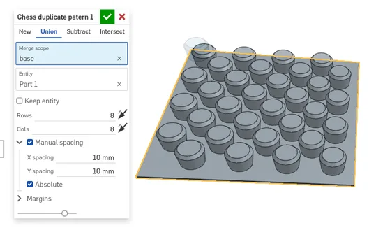
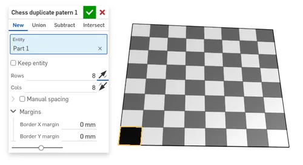

## Onshape custom feature scripts

Onshape feature script to duplicate object in "chess" patern. I created it to do some testing around 3D-printed velcro.

### Installation

=> https://cad.onshape.com/documents/836b32c33ff056dcc59e001b/w/b819e8285516b64018d0648c/e/55572aa2e303ead18d3547a9
